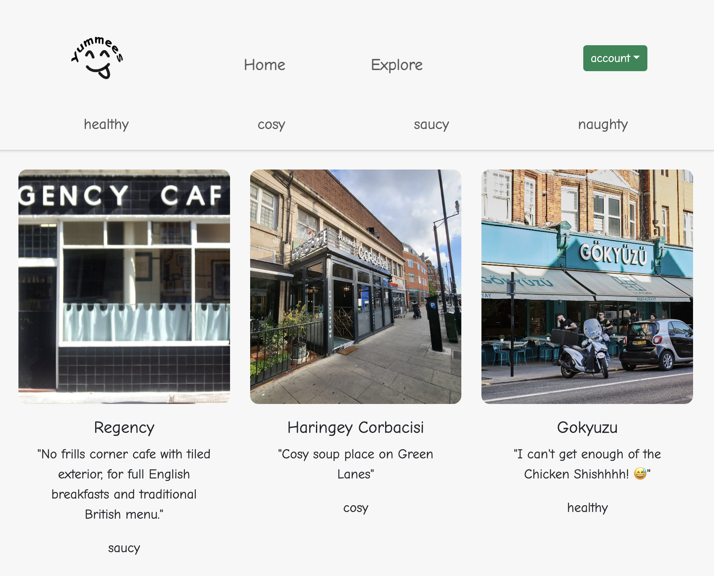
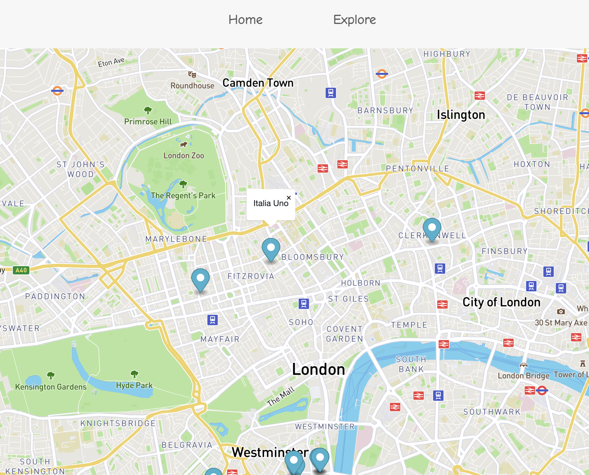
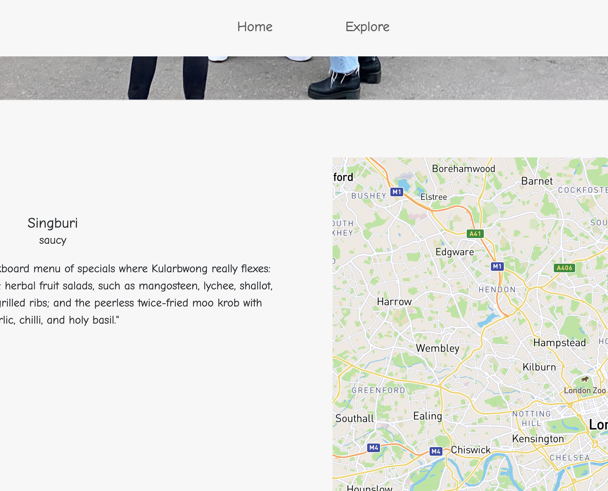

# yummees

"Yummees" is a London based app that allows users to explore and discover local eateries based on mood categories such as "healthy," "cosy," "saucy," and "naughty." It features a clean interface with photographs and brief descriptions, offering personal insights into each spot, like favourite dishes or the ambiance. Users can navigate through options, view detailed places or click on entries that catch their eye to find out where they are.

# GETTING STARTED WITH YUMMEES

This document will help you set up your development environment.

Prerequisites
Before you begin, make sure you have the following installed:

Node.js (LTS version recommended)
npm (usually comes with Node.js) or Yarn
Git for cloning the repository
Installation
Start by cloning the Yummees repository to your local machine using Git. Once cloned, navigate to the repository's root directory.

Server Setup
In the server directory, install the necessary npm packages. Then, create a .env file with the required environment variables like the MongoDB connection string, JWT secret, and Cloudinary URL. Start the server, and it should be up and running on http://localhost:3001.

Client Setup
In a new terminal, go to the client directory and run the installation for its npm packages. Set up a .env file with the required environment variables, such as the Mapbox access token. Launch the client development server, which should serve your app on http://localhost:3000, while proxying requests to your server.

Running the Application
With the server and client running, open your web browser to the client's URL. You can now enjoy the full functionality of Yummees, from exploring to adding new places!

Remember to replace any placeholder values with your actual credentials and information. This guide assumes that the server and client start commands are predefined in their respective package.json files.

# TECH STACK

Frontend Tech Stack:

- React: A JavaScript library for building user interfaces.
- Vite: A modern frontend build tool that provides a faster and leaner development experience.
- Bootstrap & React-Bootstrap: Frontend frameworks for HTML, CSS, and JS for responsive, mobile-first projects on the web.
- Formik: A library to help with building and managing forms in React.
- Yup: A schema builder for runtime value parsing and validation, often used with Formik.
- Axios: A promise-based HTTP client for making HTTP requests from the browser.
- Mapbox GL & react-map-gl: Libraries to embed interactive, customizable maps provided by Mapbox.
- React Router DOM: A standard library for routing in React.
- Cloudinary React & URL-Gen: Libraries for integrating Cloudinary, a cloud service that offers a solution to a web application's entire image management pipeline.
  dotenv: A module that loads environment variables from a .env file into process.env.

Backend Tech Stack:

- Node.js: A JavaScript runtime built on Chrome's V8 JavaScript engine.
- Express: A minimal and flexible Node.js web application framework that provides a robust set of features for web and mobile - applications.
- Mongoose: An Object Data Modeling (ODM) library for MongoDB and Node.js that manages relationships between data, provides schema validation, and translates between objects in code and their representation in MongoDB.
- bcrypt: A library to help you hash passwords.
- cors: A package for providing a Connect/Express middleware that can be used to enable CORS (Cross-Origin Resource Sharing).
- jsonwebtoken: An implementation of JSON Web Tokens for Node.js.
- Axios: Used for making HTTP requests from Node.js.

Development Dependencies:

- ESLint: A static code analysis tool for identifying problematic patterns found in JavaScript code.
